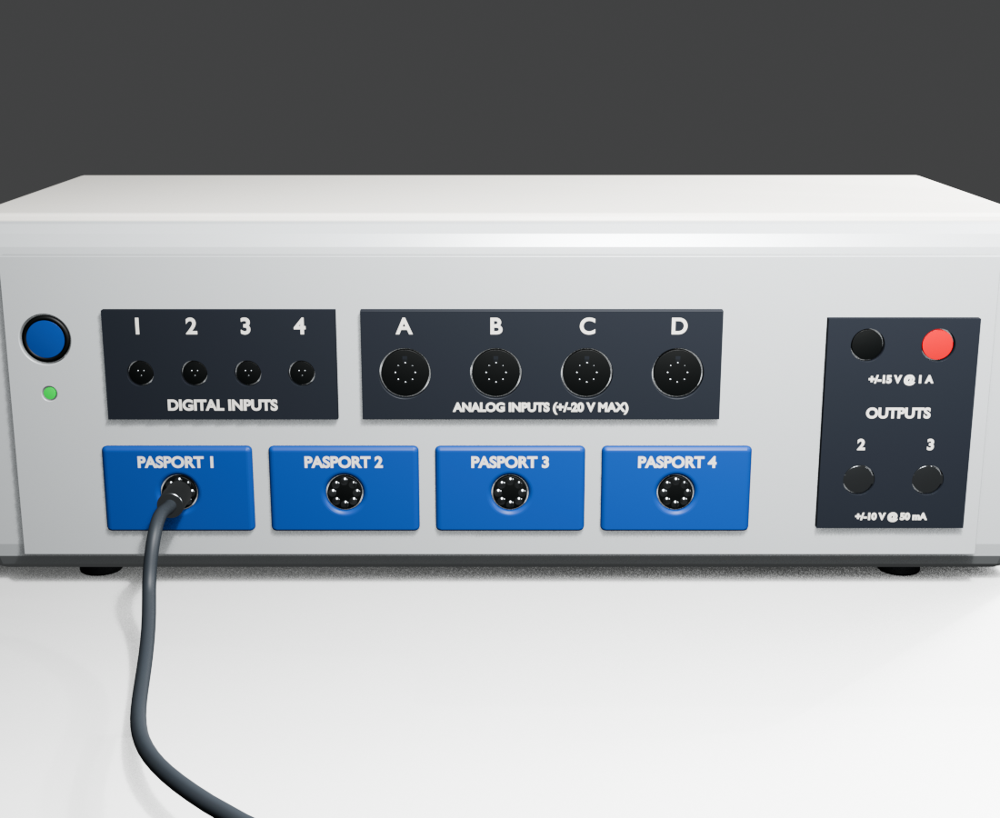

# EX5531 Ratio of Specific Heats Blender Model

公开的 EX5531/TD8572A 空气比热容比实验装置 Blender 模型，包含实验主机、V 型底座、玻璃比例管、压力传感器、PASCO 风格数据接口、软管与数据线连接结构。



## 仓库内容

- `build_ex5531_final_model.py`：Blender Python 生成器，路径已改为仓库相对路径。
- `deliverables_ex5531_final/EX5531_TD8572A_ratio_specific_heats_final.blend`：可直接编辑和预览的 Blender 文件。
- `deliverables_ex5531_final/EX5531_TD8572A_ratio_specific_heats_final.glb`：便于分享和导入其他软件的 GLB 文件。
- `deliverables_ex5531_final/verification_report.json`：尺寸、连接关系和模型结构自动验证报告。
- `deliverables_ex5531_final/glb_export_audit.json`：GLB 导出检查结果。
- `deliverables_ex5531_final/previews/`：多角度渲染预览图。
- `deliverables_ex5531_final/preview/index.html`：本地 GLB 网页预览器。

## PowerShell 预览

若 Blender 已加入 `PATH`：

```powershell
blender "$PWD\deliverables_ex5531_final\EX5531_TD8572A_ratio_specific_heats_final.blend"
```

使用 Blender 的完整安装路径：

```powershell
& 'C:\Program Files\Blender Foundation\Blender 5.1\blender.exe' "$PWD\deliverables_ex5531_final\EX5531_TD8572A_ratio_specific_heats_final.blend"
```

## 重新生成模型

```powershell
& 'C:\Program Files\Blender Foundation\Blender 5.1\blender.exe' --background --python "$PWD\build_ex5531_final_model.py"
```

生成器会覆盖 `deliverables_ex5531_final` 中的 BLEND、GLB、验证报告和预览图。当前版本由 Blender 5.1.2 生成。

## 验证

```powershell
$report = Get-Content -Raw "$PWD\deliverables_ex5531_final\verification_report.json" | ConvertFrom-Json
$report.all_checks_passed
```

预期输出为 `True`。
