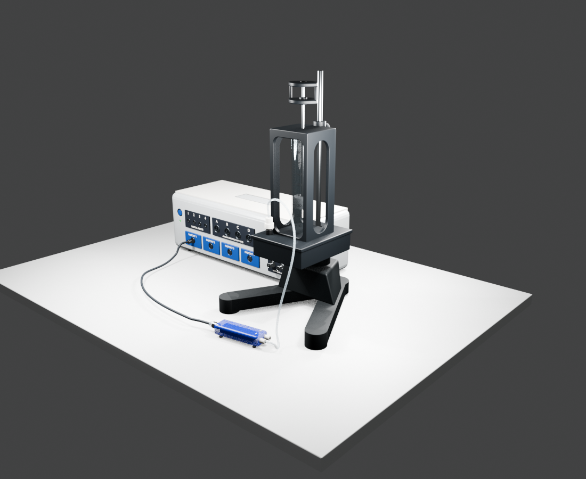
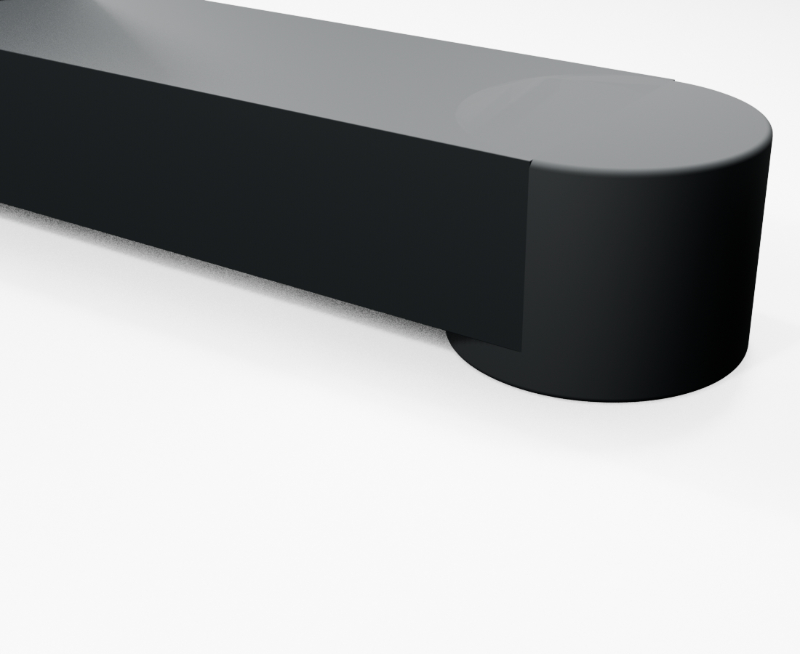

# EX5531 Ratio of Specific Heats Blender Model

公开的 EX5531/TD8572A 空气比热容比实验装置 Blender 模型，包含实验主机、V形铸铁底座、玻璃比例管、活塞和质量拨片、压力传感器、PASCO风格数据接口、软管与数据线连接结构。



## 仓库内容

- `build_ex5531_final_model.py`：可重复生成模型、预览图和验证报告的 Blender Python 脚本。
- `deliverables_ex5531_final/EX5531_TD8572A_ratio_specific_heats_final.blend`：可直接编辑和预览的 Blender 文件。
- `deliverables_ex5531_final/EX5531_TD8572A_ratio_specific_heats_final.glb`：便于共享和导入其他软件的 GLB 文件。
- `deliverables_ex5531_final/verification_report.json`：尺寸、位置、连接关系和模型结构的自动验证报告。
- `deliverables_ex5531_final/glb_export_audit.json`：GLB 导出结构检查结果。
- `deliverables_ex5531_final/previews/`：多角度及局部细节预览图。
- `deliverables_ex5531_final/preview/index.html`：本地 GLB 网页预览器。
- `THIRD_PARTY_NOTICES.md`：构建工具、运行时依赖、许可证和外部素材审计说明。
- `THIRD_PARTY_LICENSES/`：需要随仓库保留的第三方许可证文本。

## 当前模型重点

- 玻璃管刻度扩展至 90：共 37 条刻度、10 条长刻度；数字标注为 90、80、70、60、50、40、30、20、10，底部 0 刻度保留刻度线但不显示数字。
- 小刻度间距约 6.22 mm，最高 90 刻度与玻璃管顶端保留约 9.0 mm 间隙。
- 刻度数字贴合玻璃管曲面并保持正常字重。
- 活塞Z向高度约 26.4 mm。
- PistonRod总长约 277.2 mm，并与上拨片顶面齐平。
- 左右底脚改为固定式完整圆柱橡胶脚，直径 52 mm、高 39 mm；顶面与 V 形梁顶面平齐，梁端向圆柱内部搭接 26 mm，并以 1.2 mm 圆角消除突出棱角；两根调节螺杆保持移除。
- 包含精细化数字输入、模拟输入、PASPORT和BNC输出接口。



## PowerShell预览

Blender已加入 `PATH` 时：

```powershell
blender "$PWD\deliverables_ex5531_final\EX5531_TD8572A_ratio_specific_heats_final.blend"
```

使用本机当前Blender安装路径：

```powershell
& 'D:\game\steam\steamapps\common\Blender\blender.exe' "$PWD\deliverables_ex5531_final\EX5531_TD8572A_ratio_specific_heats_final.blend"
```

## 重新生成模型

```powershell
& 'D:\game\steam\steamapps\common\Blender\blender.exe' --background --python "$PWD\build_ex5531_final_model.py"
```

生成脚本使用自身所在目录作为项目根目录，不依赖原作者的本机路径。当前交付文件由 Blender 5.2.0 LTS 生成。

## 验证

```powershell
$report = Get-Content -Raw "$PWD\deliverables_ex5531_final\verification_report.json" | ConvertFrom-Json
$report.all_checks_passed
```

预期输出为 `True`。

## 第三方开源组件

本项目使用 Blender、Blender内置Python和three.js。完整版本、用途、许可证及“未使用/未打包”项请查看 [`THIRD_PARTY_NOTICES.md`](THIRD_PARTY_NOTICES.md)。
